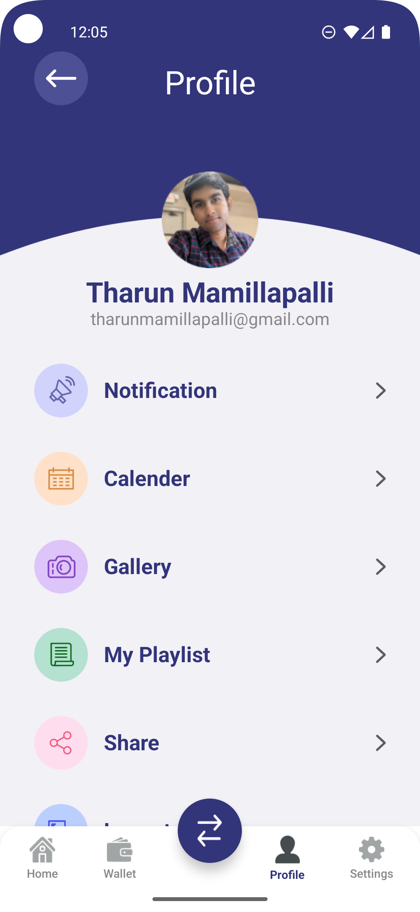

# Tharun Compose UI

Tharun Compose UI is a modern Android application built completely with Jetpack Compose.  
This app demonstrates beautiful UI, smooth animations, intro screens, profile UI, custom bottom navigation, and reusable UI components.

---

## Features

- Intro screen with animated items
- Custom profile screen
- Bottom navigation bar
- Floating action button
- Custom buttons and components
- Clean modern UI theme
- Jetpack Compose only (no XML)
- Navigation with Compose
- Reusable UI items

---

## Tech Stack

- Kotlin
- Jetpack Compose
- Material 3
- Navigation Compose
- State (remember / mutableStateOf)
- Scaffold / Column / Row layouts
- AnimatedVisibility
- ContentScale UI usage

---

## Screenshots

| Intro | Home | Profile |
|-------|------|---------|
|  |  |  |

---

## Project Structure

app/
├── screens/
├── components/
├── navigation/
screenshots/
README.md

---
## What this project demonstrates

- Modern Android UI design using Jetpack Compose
- Handling animations with AnimatedVisibility
- Navigation using NavHost + composable
- Compose-only layouts without XML
- Reusable UI elements and color themes
- State and remember usage

---

## Developer

**Tharun Mamillapalli**  
Android Developer  
Focused on modern UI with Jetpack Compose and clean user experiences.
